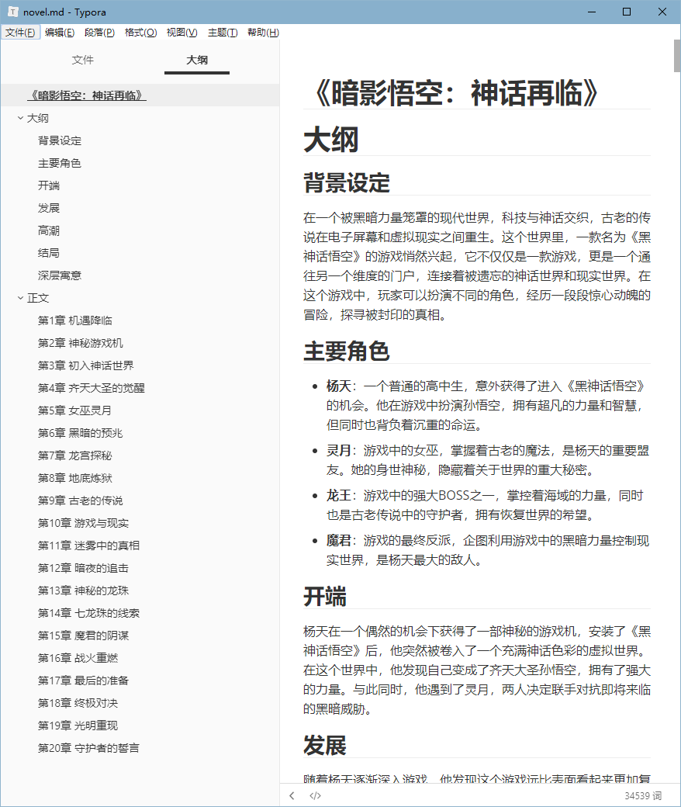

# Gen_Novel

使用通义千问api生成小说

## 快速上手

### 1. 环境准备

安装所需要的依赖

```bash	
pip install -r requirements.txt
```

### 2.实现LLM接口

本项目使用通义千问api，运行项目前需要先实现`LLM.py`中的`ChatLLM`类

如需要获取通义千问api可前往官网 [阿里云帮助中心]([如何获取API Key_大模型服务平台百炼(Model Studio)-阿里云帮助中心](https://help.aliyun.com/zh/model-studio/developer-reference/get-api-key?spm=a2c4g.11186623.help-menu-2400256.d_3_0.38484823sp11R3&scm=20140722.H_2712195._.OR_help-T_cn#DAS#zh-V_1))

```python
api_key = "替换为自己的api"

class ChatLLM:
    def __init__(self, model_name="qwen-long"):
        self.client = OpenAI(
            api_key=api_key,
            base_url="https://dashscope.aliyuncs.com/compatible-mode/v1",
        )
        self.model_name = model_name

    def chat(self, messages, temperature=0.8, top_p=0.8):
        response = self.client.chat.completions.create(
            model=self.model_name,
            messages=messages,
            temperature=temperature,
            top_p=top_p,
        )

        return response.choices[0].message.content
```

### 3.运行项目

- 运行`demo.py`将自动创作小说，并将结果保存在`novel.md`文件中
- 也可以修改`demo.py`中的`user_idea`和`user_requirements`，以生成类型的小说

```python
from AIGN import AIGN
from LLM import ChatLLM
from gen_Novel import NovelGenerator

user_idea = "写一本游戏相关题材的短小说，以《黑神话悟空》背景为例，实现《西游记》的重构暗黑版本，加入游戏元素，要有深度的角色塑造，情节紧凑，带有冒险和奇幻元素"
user_requirements = "生成20章左右，这些章需要概括小说的所有内容"

chat_llm = ChatLLM()
aign = AIGN(chat_llm)
generator = NovelGenerator(aign)
novel = generator.generate_novel(user_idea, user_requirements)
```


### 4.结果展示

我上传了生成的一部小说，其内容如下



